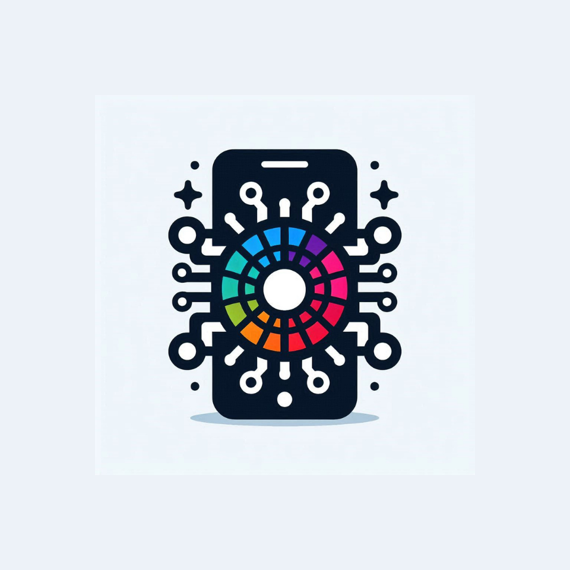
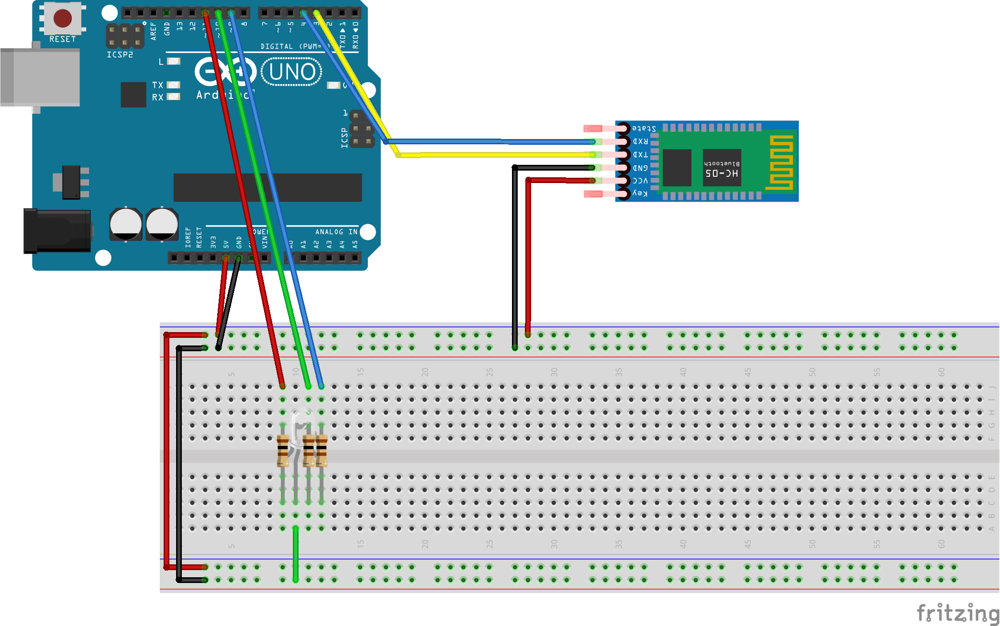
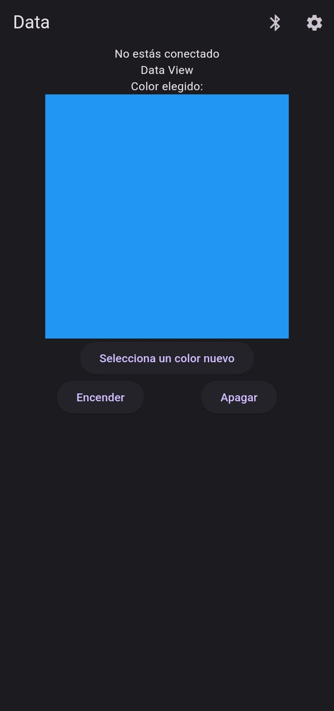
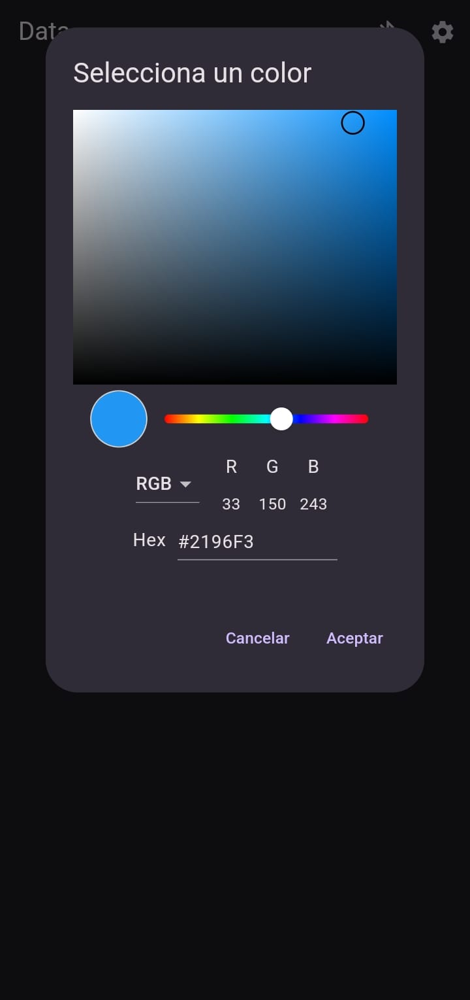
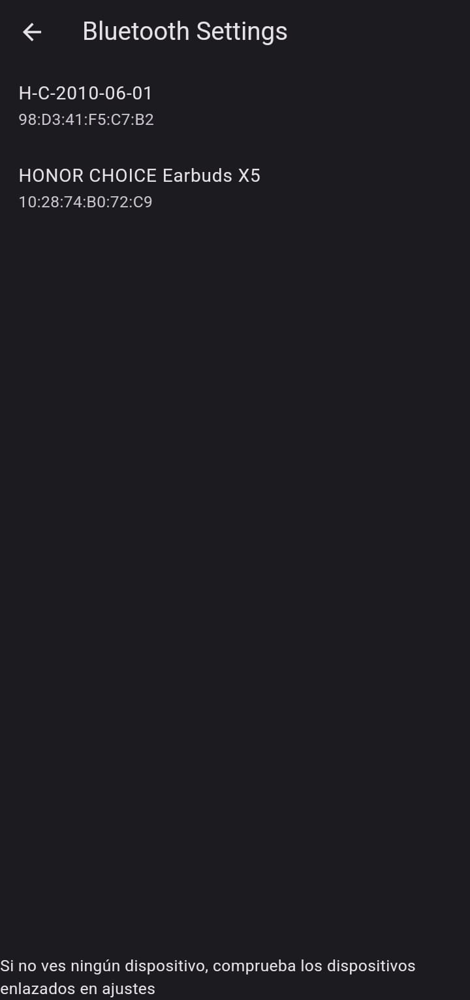

# Color Picker

**Color Picker** is a mobile application that communicates with an **Arduino UNO** via **Bluetooth** to control an **RGB LED**. The app allows users to select colors directly from their mobile device and sends the corresponding values to the Arduino, adjusting the LED color in real-time.

## Table of Contents

- [Features](#features)
- [Technologies Used](#technologies-used)
- [Installation](#installation)
  - [Requirements](#requirements)
  - [Setup Steps](#setup-steps)
- [Screenshots](#screenshots)
- [Contributing](#contributing)
- [License](#license)

## Features

- Choose colors from the mobile app to change the color of an RGB LED.
- Real-time communication with an Arduino UNO via Bluetooth.
- Simple interface for visualizing and selecting colors.

## Technologies Used

- **Flutter**: Mobile app development.
- **Dart**: Programming language for the app.
- **Arduino**: Receives color values and controls the LED.
- **Bluetooth**: Wireless communication between the app and Arduino.
- **RGB LED**: Displays the selected colors.

## Installation

### Requirements

- **Arduino UNO**
- **HC-05 Bluetooth Module**
- **RGB LED** and resistors
- **USB cable** to connect Arduino to your computer
- **Color Picker Mobile App** 

### Setup Steps
  - Build the following circuit using the Arduini UNO, the HC-05 module and the RGB LED
  
    
  - Upload the script in the /arduino/color_pickeer/color_picker.ino to the *Arduino UNO*
  - Download the Flutter app, built based on the code in the present repository
  - Connect the phone with the HC-05 module and send the colors you desire!
## Screenshots

    
    
    

## Contributing
We welcome contributions to this project! Feel free to fork the repository and submit pull requests. Don’t hesitate to report issues or suggest improvements through the Issues section.
## License
GNU Affero General Public License v3.0
